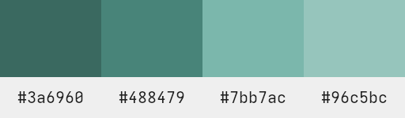
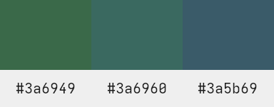

# Seiheki
> An elegant colorscheme for a more civilized age

Seiheki is a light-theme first colorscheme aiming for a classy and subtle look. It takes its name from the traditional japanese color that was used to create this palette.

## Design

 - **Elegance**: seiheki is elegant and non disruptive, one shouldn't notice it but enjoy it.
 - **Uniqueness and balance**: seiheki elements are distinguishable while keeping a sense of harmony and belonging, each element is unique in it's own right while fitting in with the rest.
 - **Soothing**: seiheki is built with care, finding the perfect balance between saturation and dullness to be easy on the eye and on the mind.

## Palettes

Elements are grouped into palettes. Each palette is crafted with a motif and named after it.

### Cheatsheet

```
Mountain: #efefef #cccccc #474747 #1f1f1f
Seiheki:  #3a6960 #488479 #7bb7ac #96c5bc
Catawba:  #693a43 #91505c #a8616e #c5969f
Forest:   #3a6949 #3a6960 #3a5b69
Sea:      #96c5a5 #96c5bc #96b7c5
Desert:   #693a5b #693a43 #69493a
Coral:    #c596b7 #c5969f #c5a596
```

### Mountain

The base for both the light and dark variants, it offers the light and shadow that gives life to seiheki.

> 

### Seiheki

The main element, a palette of shades of this beautiful color.

> 

### Catawba

Seiheki's complementary, some more shades to play with.

> 

### Forest and Sea

Seiheki presides this arrangement with two companions, this 3 colors together with their lighter variants offer serene sensations and calm tones.

#### Forest

> 

#### Sea

> 

### Desert and Coral

Catawba gives sense to this complementary palette, giving the heat and coziness that balances the Forest and the Sea.

#### Desert

> 

#### Coral

> 

## Ports

 - [nvim](https://github.com/delightfulagony/seiheki-nvim)
 - [alacritty](https://github.com/delightfulagony/seiheki-alacritty)
 - [Xresources](https://github.com/delightfulagony/seiheki-xresources)

## Background

Seiheki is a colorscheme born out of necessity, I wanted to use a light colorscheme on my computer and couldn't find one that felt right, so I set out to do one myself, seiheki is the result of that necessity and some failed attemps at creating the perfect theme. Seiheki is in no way perfect but as Voltaire said "The best is the enemy of the good".

## Color choices

Seiheki's design choices are those of symmetry and balance.

 - The colorscheme revolves around Seiheki (#3A6960), a traditional japanese color meaning literally "green-blue" and it's complementary, Catawba (#693A43).
 - The light counterparts are the inverses of those colors, Tuscany (#C5969F) being the inverse of Seiheki and Opal (#96C5BC) being the inverse of Catawba.
 - **Mountain** is a palette with a black that's not completely black and a white that's not entirely white, paired with a dark gray and a light gray that are equally distant from their respective counterparts.
 - **Seiheki** palette is a collection of shades of Seiheki, in the same way as mountain is a collection of shades of gray it is equally spaced.
 - **Catawba** palette is the counterpart to Seiheki, following the same philosoply.
 - **Forest** is built around Seiheki, using two analogous colours: Police Blue (#3A5B69) and Deep Moss Green (#3A6949) for a soothing and cohesive experience.
 - **Sea** is the light version of Forest, a more pastel version of Forest it uses Opal and it's analogous in the same way as Forest does: Wild Blue Yonder (#96B7C5) and Eton Blue (#96C5A5).
 - **Desert** is the counterpart to forest, based around Catawba, it uses it's two analogous: Coffee (#69493A) and Halaya Ube (#693A5B).
 - **Coral** is the light version of Desert, in the same way as Sea, it uses Tuscany and it's analogous: Khaki (#C5A596) and Pastel Violet (#C596B7).

## Inspiration

This colorsheme and the way it's defined is inspired by [Nord](https://github.com/arcticicestudio/nord) and [Catppuccin](https://github.com/catppuccin/catppuccin).

## Examples


